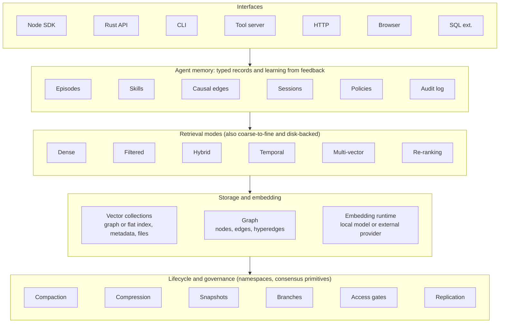

# Agent Memory Engine Specification

Oct 7, 2026 · @Rajesh Govindarajan

## 1. Purpose and scope

The engine is an embedded memory substrate for AI agents: it stores what an agent observes, decides and learns, and recalls it by similarity, by filter, by time and by explicit relationship, all from local files with no server, no API key and no per-query fee.

**Problem it solves.** Language models forget everything between calls. An agent needs a durable place to write notes, outcomes and relationships, and a way to find the right note later when the situation resembles, but never exactly repeats, an earlier one. Exact-match databases answer only exact questions; this engine answers "what is closest to this?" and "what is connected to this?".

**In scope**

- Vector storage with approximate and exact nearest-neighbour search, metadata, durable persistence and crash recovery.
- Local text embedding with recorded provenance, plus pluggable external providers.
- Retrieval modes beyond plain similarity: filtered, hybrid sparse+dense, time-decayed, coherence-gated, multi-vector, re-ranked, coarse-to-fine, disk-backed.
- A property graph with hyperedges, a query-language subset and traversal, sharing the same embedding space as the vector store.
- Typed agent memory: working, episodic, semantic and procedural records, plus causal edges, sessions, policies and an append-only audit log.
- Learning from recorded feedback: adapter weights, consolidation that protects old knowledge, outcome-aware routing.
- Lifecycle controls: compaction, compression, snapshots, copy-on-write branches.
- Governance: namespaces, per-record read capabilities, replication and consensus primitives, an optional shared memory service.
- Delivery as a Rust core with bindings for Node.js, a browser build, a CLI, a tool-protocol server for agent frameworks, an HTTP service and a SQL-database extension.

**Out of scope**

- Deciding what is worth remembering, which evidence to trust, when a memory expires, or which actions recalled context may influence. Those remain application policy.
- Training or hosting language models. The engine embeds and retrieves; generation happens elsewhere.
- Acting as the system of record for transactional business data. Ordinary tables remain the right tool for exact lookups and joins.

**Design principles**

1. Local first. The default path reads and writes files on the host; hosted services are optional and create a separate data boundary.
2. Learning comes from recorded outcomes and explicit feedback, never from reads alone. Searching memory must not silently change it.
3. Honest fallbacks. When a semantic model is unavailable the engine may degrade to a lexical embedder, but it must say so, record it, and refuse to mix embedding spaces.
4. Measurable claims. Every performance statement carries dataset size, dimension, index parameters, hardware, latency percentiles, throughput and recall together.
5. Small, composable crates or modules. Specialised retrieval, compression and governance features ship as separate units that the core does not require.
6. Retrieved context is untrusted input until policy checks pass. Tool execution stays separate from memory retrieval.

## 2. Core concepts

Everything the engine stores is a vector with an identity, optional metadata and optional relationships; the memory classes agents work with are typed conventions layered on top of those three primitives.

| Concept | Definition | Notes |
| --- | --- | --- |
| Vector | Fixed-length list of 32-bit floats | One dimension count per collection, chosen at creation and immutable afterwards |
| Record | `id` (string, caller-supplied or generated) + vector + metadata | Metadata is a JSON object of string keys; stored verbatim, returned with search results |
| Collection | A named store with one dimension count, one distance metric, one index configuration and one embedding space | Collections never share vectors; a query targets exactly one |
| Distance metric | Euclidean, cosine, dot product, Manhattan | Chosen per collection; search returns a distance where lower is closer, plus a derived similarity where the metric allows |
| Embedding | A function from content (text, or numeric features) to a vector | The engine ships a local text model; the application may supply its own vectors |
| Embedding space identity | `{ embedderKind, modelId, dimension, normalize, prefixPolicy, promptTemplateHash }` | Recorded on every collection; writes or queries from a different space are refused, not coerced |
| Index | Structure that makes nearest-neighbour search fast | Flat (exact) and graph-based approximate (HNSW); others pluggable |
| Filter | Equality predicates over metadata keys applied to a search | Narrowing happens around the index; see section 6 for the filtering strategies |
| Graph node | An entity with an id, labels, string properties and an embedding | Lives in a graph collection; embedding allows similarity search over nodes |
| Edge | Directed, typed relation between two nodes with confidence and properties | Hyperedge: one relation over N nodes |
| Memory class | Working, episodic, semantic, procedural, causal, learning, shared, auditable | Application semantics over records and edges (section 8) |
| Witness entry | Hash-linked log record of a write | Makes history tamper-evident, not encrypted |
| Snapshot | Serialized, checksummed copy of a collection | Full now; incremental is an enhancement |
| Branch | Copy-on-write fork of a collection | Lets an agent experiment without copying data |

**How the pieces relate.** An agent turns an observation into a record (embed, attach metadata), stores it in a collection, and may connect it to other records with edges. Later it embeds a query, searches the collection, optionally walks edges from the hits, and feeds the result to a decision. Recording the outcome of that decision is a separate, explicit write, and only such writes may change learned state.

## 3. Architecture

One native core, written in a systems language, is wrapped by every interface; the agent memory layer is a typed convention over the retrieval and storage layers, and lifecycle tools operate on storage underneath.



*Engine architecture, five layers: typed agent memory sits on vector, graph and embedding stores behind one core.*

Calls flow top down: an interface receives a request, the memory layer maps it to typed records, retrieval picks a search strategy, and storage answers from the vector collections, the graph and the embedding runtime; the lifecycle band acts on stored data outside the query path.

**Component responsibilities**

- **Core library.** Vector collections, indexes, metadata, persistence, crash recovery. Single process, single writer, concurrent readers. No network code.
- **Embedding runtime.** Loads a local sentence-embedding model through a portable inference runtime, with a pure-WebAssembly path so the browser build needs no native binary. Exposes query and passage embedding, batch embedding, and a worker pool.
- **Retrieval modules.** Each advanced mode is its own module with a uniform `search(query, k, options)` contract so an application can swap strategies without changing call sites.
- **Graph store.** Separate persistent store sharing the embedding dimension of the vector collections so node similarity and vector similarity are comparable.
- **Agent memory layer.** Typed record schemas and the memory loop (section 8). It is the only layer allowed to change learned state, and only on explicit feedback writes.
- **Lifecycle and governance.** Compaction, compression, snapshots, branches, namespaces, capability gates, replication and consensus primitives, and an optional hosted shared-memory service with its own data boundary.
- **Interfaces.** Thin adapters: a Node.js binding over the native core with a WebAssembly fallback, a browser package, a CLI, a tool-protocol server for agent frameworks, an HTTP service, and a SQL-database extension. Adapters add no behaviour of their own.

**Deployment surfaces and data boundaries**

| Surface | Data lives in | Typical use |
| --- | --- | --- |
| Embedded library (Node.js, Rust) | Files under the application's own directory | Agent memory inside one process |
| Browser package | Browser memory and browser storage | Client-side recall, demos, offline tools |
| CLI | Files under the current project | Developer and coding-assistant memory |
| Tool-protocol server | Same files, exposed to an agent framework over stdio | Giving an agent remember and recall tools |
| HTTP service | The service's own boundary | Several processes sharing one store |
| SQL-database extension | The database's boundary | Vector memory beside relational data |
| Portable signed container | A single file with lineage and witnesses | Shipping a memory between hosts |
| Shared memory service | A hosted plane, opt-in | Cross-agent collective knowledge |

## 4. Vector store

A collection is a durable file-backed set of records with one dimension count and one metric, searched through an exact or approximate index; the public contract is deliberately small so every interface exposes the same eight operations.

**Collection options**

| Option | Type | Default | Meaning |
| --- | --- | --- | --- |
| `dimensions` | integer > 0 | required | Vector length; immutable after creation |
| `distanceMetric` | euclidean, cosine, dotProduct, manhattan | cosine | Scoring function |
| `storagePath` | path | required for persistence | Directory or file the collection owns; omit for in-memory |
| `index.kind` | flat, hnsw | hnsw | Exact scan or graph-based approximate search |
| `index.m` | integer | 16 | Neighbours per node in the graph index |
| `index.efConstruction` | integer | 100 to 200 | Candidate list size while building |
| `index.efSearch` | integer | 100 | Candidate list size while querying; overridable per query |
| `index.maxElements` | integer | 1,000,000 | Capacity hint for preallocation |
| `quantization` | none, scalar, product {subspaces, k} | none | Reserved; see section 10 and the gap list in section 15 |
| `mmapVectors` | boolean | false | Memory-map the vector file instead of loading it |

**Operations**

| Operation | Signature | Behaviour |
| --- | --- | --- |
| insert | `(record) -> id` | Validates dimension and embedding space; writes vector, metadata and index entry atomically |
| insertBatch | `(records[]) -> id[]` | Same guarantees, one write transaction, parallel index build |
| get | `(id) -> record or null` | Returns vector and metadata |
| search | `(query) -> result[]` | `query = { vector, k, filter?, efSearch?, includeVectors?, includeMetadata? }`; results sorted by distance ascending |
| update | `(id, record)` | Replaces vector and metadata; index entry rebuilt |
| delete | `(id) -> boolean` | Removes from storage and index |
| count | `() -> integer` | Live record count |
| close / flush | `()` | Durable write of pending state |

**Search result**

```
{ id: string, score: number, vector?: float32[], metadata?: object }
```

`score` is the distance under the collection metric; lower is closer. For cosine, `similarity = 1 - score`. Implementations must document this on every surface, because callers routinely invert it.

**Metadata filter semantics.** `filter` is a map of key to value; a record matches when every key is present in its metadata and equal. The reference core applies the filter after the index returns k candidates, which can return fewer than k rows for selective filters. Section 6 defines the required improvements: over-fetch with a target k, predicate-aware traversal, and index-embedded capability masks.

**Persistence and recovery**

- All records, metadata and collection options are written to the storage path. Reopening the path restores the collection and its searchability without application code.
- The approximate index may be rebuilt from stored vectors on open. Cold-start time therefore grows with collection size and must be measured; persisting the index itself is an enhancement (section 16).
- Writes are atomic per call: a crash mid-batch leaves either the whole batch or none of it.
- A manifest beside the data records the embedding space identity, record count, index parameters, schema version and creation time. Opening a collection with a different embedding space is refused with an error naming both sides.

**Concurrency.** One process owns a storage path. Within that process, readers run concurrently; writers serialise through a lock. Cross-process sharing goes through the HTTP service or the SQL extension, never through shared files.

**Limits.** Dimension up to 4,096. Record id up to 512 bytes. Metadata up to 64 KB per record. Batch up to 10,000 records per call. These are defaults an implementation may raise; they exist so that misuse fails early.

## 5. Embedding layer

The engine ships a local sentence-embedding model as the default so semantic memory works with no account and no network, records which embedder produced every vector, and refuses to mix embedding spaces.

**Provider interface**

```
interface EmbeddingProvider {
  name: string                      // e.g. "onnx:all-MiniLM-L6-v2", "api:text-embedding-3-small", "local-ngram"
  dimensions: number
  semantic: boolean                 // false for hash or n-gram fallbacks
  init(): Promise<void>             // loads or downloads the model; idempotent
  embedQuery(text): Promise<float32[]>
  embedPassage(text): Promise<float32[]>
  embedBatch(texts, role): Promise<float32[][]>
  identity(): EmbeddingSpaceIdentity
}
```

Query and passage are separate calls because several model families expect different prefixes for the two roles; the provider owns the prefix policy so callers never hand-write it.

**Built-in providers**

| Provider | Dimensions | Runtime | Use |
| --- | --- | --- | --- |
| Local MiniLM-class sentence model | 384 | Portable inference runtime, WebAssembly path available | Default semantic embedder; 23 MB download cached once |
| Local BGE-small or E5-small class | 384 | Same, with fp16 and int8 variants | Higher-quality drop-in; same dimension so indexes stay compatible |
| External API provider | provider-defined | HTTPS | Bring an existing vendor model; the engine records the model id |
| Character n-gram hash | configurable, default 256 | None | Deterministic lexical fallback for tests and offline builds; never silently used for production |

**Provenance invariant.** Every collection records `{ embedderKind, modelId, dimension, normalize, prefixPolicy, promptTemplateHash }`. An insert or query whose provider identity differs from the collection's is refused with an error naming both identities. Legacy collections without provenance open read-only for vector writes. A re-embed command migrates a collection from one space to another by re-reading source text from metadata.

**Fallback contract.** If the semantic model cannot be loaded, the engine may fall back to the hash embedder only when the caller opted in. The fallback is logged once, exposed through `isReady()` and `getActiveModelId()`, and written into the manifest so the next process knows. A collection built on the fallback refuses queries from the semantic embedder and vice versa.

**Throughput.** Batch embedding uses a worker pool sized to available cores; the reference measured roughly 2 ms per sentence single-threaded on CPU and 30 ms for 1,968 sentences with the n-gram fallback. Batch size, worker count and model variant are configuration, and the ingest API reports embed time separately from index time.

**Model management.** Models are pinned by id and checksum, downloaded to a per-user cache, and can be prepopulated for offline or regulated deployments. The engine never fetches a model during a query.

## 6. Retrieval

Plain dense search is the default; every other mode is a module that implements the same `search(query, k, options)` contract and can be swapped without changing application code.

| Mode | What it does | When to use it | Reference status |
| --- | --- | --- | --- |
| Dense similarity | k nearest vectors under the collection metric, exact or approximate | General semantic recall | Production |
| Metadata filter | Equality predicates on metadata keys | Narrow by tenant, kind, project | Production, but post-filters the candidate set (see below) |
| Predicate-aware traversal | Applies the filter while walking the graph index so selective filters keep recall | Filters that match under 10% of records | Research |
| Capability-gated search | Each record carries a 64-bit required-capability mask; the query carries a held mask; unauthorised records are skipped before distance computation | Multi-tenant or multi-agent isolation inside one index | Research; measured 7.9x faster than post-filtering at a 12.5% access ratio |
| Hybrid sparse + dense | Fuses lexical (BM25) and vector rankings; reciprocal rank fusion and relative score fusion both supported | Exact identifiers, names and codes alongside meaning | Proof of concept |
| Temporal decay | Multiplies similarity by `exp(-lambda * age)` | Recent memories should outrank old ones | Implemented, moderate sizes |
| Coherence gating | Boosts memories that have many close neighbours in the corpus | Prefer stable knowledge over one-off observations | Implemented with an exact pairwise graph; approximate graph is an enhancement |
| Multi-vector late interaction | Scores a query's token vectors against each passage's token vectors (MaxSim) | Long passages where one vector loses detail | Implemented |
| Graph re-ranking | A small graph neural network reorders a noisy candidate set | Noisy corpora, learned relevance | Implemented research surface |
| Coarse-to-fine funnel | Searches truncated prefixes of nested-dimension embeddings first, then refines | Truncatable embeddings, large collections | Implemented |
| Disk-backed index | Keeps the graph index on SSD with a small in-memory entry layer | Collections larger than RAM | Implemented |
| Diversity (MMR) | Penalises results too similar to each other | Context windows that should not repeat themselves | Core, Rust surface only |

**Filter semantics the implementation must provide.** The reference applies metadata filters after the index returns its k candidates, which can return fewer than k matches for selective filters. The required behaviour for a new implementation:

1. `k` means matching results, not candidates. The engine over-fetches internally (starting at `4k`, doubling up to a configured ceiling) until `k` matches are found or the collection is exhausted.
2. Selective filters, measured by a cheap cardinality estimate on the metadata index, switch to predicate-aware traversal automatically.
3. The response reports `fetched`, `matched` and whether the result is complete, so callers can see what happened.

**Query options common to every mode**

```
{
  k: number,
  filter?: { [key]: value },
  efSearch?: number,            // approximate index effort for this query
  includeVectors?: boolean,
  includeMetadata?: boolean,    // default true
  capabilities?: uint64,        // held capability mask
  decay?: { lambda, timestampKey },
  fusion?: { lexical: string, method: "rrf" | "rsf", alpha }
}
```

**Explainability.** Every result may carry an `explain` block: the per-dimension contribution to the score for numeric fingerprints, the fused component scores for hybrid search, or the decay factor applied. Explanations are computed on request, never stored.

## 7. Graph store

The graph store holds explicit relationships between memories in a persistent property graph whose nodes carry embeddings, so a query can combine "what is connected to this" with "what is similar to this" in one process.

**Data model**

| Element | Fields | Constraints |
| --- | --- | --- |
| Node | `id`, `labels[]`, `properties{}`, `embedding` | Embedding dimension equals the graph's configured dimension; properties are string-valued in the reference, typed values are an enhancement |
| Edge | `id`, `from`, `to`, `type`, `confidence` (0 to 1), `properties{}`, `embedding` | Directed; both endpoints must exist |
| Hyperedge | `id`, `nodes[]`, `type`, `confidence`, `properties{}`, `embedding` | One relation over two or more nodes, e.g. a collaboration or a causal set |

**Operations**

- `createNode`, `createEdge`, `createHyperedge`, `deleteNode`, `batchInsert({nodes, edges})`
- `query(cypherSubset)` returning `{ nodes, edges, stats }`
- `kHopNeighbors(nodeId, k)` returning node ids within k hops over any edge type
- `searchNodes(embedding, k)` and `searchHyperedges(embedding, k)` for similarity over graph elements
- `begin`, `commit`, `rollback` for multi-statement atomicity
- `subscribe(callback)` for change notifications
- `stats()` returning node count, edge count and average degree

**Query language.** A practical subset of a Cypher-style pattern language is required; anything outside the subset must raise an error naming the construct, never return an empty result.

| Supported | Not supported in the reference (candidates for your implementation) |
| --- | --- |
| `MATCH (n) RETURN n`, label index `MATCH (n:Label)`, point lookup `WHERE n.id = 'x'`, inline properties `(n {k: 'v'})` | `CREATE`, `SET`, `DELETE` through the query path (use the API) |
| `WHERE` with `=`, `<>`, `<`, `<=`, `>`, `>=`, `AND`, `OR`, arithmetic, property access | Variable-length paths `[*1..3]` (use k-hop) |
| Typed and untyped edge patterns `MATCH (a)-[r:TYPE]->(b)` | Chained patterns, hyperedge patterns in `MATCH` |
| Parsing of `ORDER BY`, `SKIP`, `LIMIT`, `count()`, `collect()` | Their execution: parsed but not applied |
|  | `CONTAINS`, `STARTS WITH`, `IN`, `IS NULL`, regular expressions |

**Persistence.** The graph persists to its own file through an embedded transactional key-value store. Opening an existing path must hydrate nodes, edges and embeddings lazily on first access; a reopened graph that reads as empty is a defect, not a configuration choice.

**Sharing the embedding space.** Graph dimension defaults to the vector collection's dimension so a vector hit can be looked up as a node and vice versa. Region or cluster nodes may carry the mean of their members' vectors, which lets "find the region most like this record" run as an ordinary similarity search.

## 8. Agent memory model

Agent memory is a set of typed record schemas and one loop over the primitives above: capture, embed, persist, recall, decide, record the outcome, adapt, and periodically consolidate.

**Memory classes**

| Class | Holds | Representation | Lifetime |
| --- | --- | --- | --- |
| Working | Current task, scratchpad, tool-call cache, recent turns | Session record with namespace and time-to-live | Minutes to hours; expires |
| Episodic | What happened: task, actions, observations, critique, outcome | Reflexion episode records, embedded on task plus critique | Long; compacted by importance |
| Semantic | Facts with confidence, source, tags and relations | Vector records with metadata and graph edges | Long; superseded explicitly |
| Procedural | Skills: name, description, parameters, examples, success rate, usage count | Skill records, embedded on description | Long; statistics updated on use |
| Causal | Cause set, effect set, confidence, context | Hyperedges in the graph | Long; confidence updated by outcomes |
| Learning | Trajectories, rewards, adapter weights, consolidation state | Learning sessions and policy state | Managed by section 9 |
| Shared | Contributions from other agents with provenance and votes | Records in the shared service | Governed separately |
| Auditable | Every write, hash-linked | Witness log entries | Append-only |

**Typed record schemas**

```
ReflexionEpisode { id, task, actions[], observations[], critique, outcome?, reward?, createdAt, embedding }
Skill            { id, name, description, parameters{}, examples[], successRate, usageCount, embedding }
CausalEdge       { id, causes[], effects[], confidence, context, embedding }
SessionTurn      { id, sessionId, role, content, toolCalls[], createdAt, ttl }
SemanticFact     { id, text, confidence, source, tags[], relations[], collection, embedding }
PolicyState      { id, stateKey, actionValues{}, updatedAt }
WitnessEntry     { seq, prevHash, hash, operation, recordId, timestamp }
```

**Typed operations**

| Operation | Effect |
| --- | --- |
| `storeEpisode(task, actions, observations, critique)` | Embeds and stores an episode; appends a witness entry |
| `retrieveEpisodes(queryEmbedding, k)` | Similar past episodes, newest first on ties |
| `createSkill(name, description, parameters, examples)` | Stores a skill with zero usage |
| `searchSkills(queryEmbedding, k)` | Relevant skills with success rate and usage count |
| `recordSkillOutcome(skillId, success)` | Updates success rate and usage count; the only path that changes them |
| `addCausalEdge(causes, effects, confidence, context)` | Creates a hyperedge |
| `queryCausal(queryEmbedding, k)` | Causal edges ranked by similarity times confidence |
| `startSession`, `appendTurn`, `endSession` | Working memory with TTL |
| `verifyWitnessLog()` | Recomputes the hash chain and reports the first break |

**The memory loop**

1. Capture an event, fact or outcome.
2. Embed it with the collection's provider.
3. Persist vector, metadata and relationships.
4. Recall by similarity, filter, time or graph when a new situation arises.
5. Use the recalled context in a decision.
6. Record the outcome and any feedback as an explicit write.
7. Adapt ranking or learned state from that write (section 9).
8. Compact, snapshot, branch or replicate on a schedule (section 10).

Reads never mutate memory. Steps 6 and 7 are the only places learned state changes, and both are logged to the witness chain.

**Consolidation.** A scheduled job promotes repeated episodic patterns into semantic facts and procedural skills: cluster episodes by embedding, require a minimum cluster size and success rate, write the distilled record, and link it back to its source episodes with edges so provenance survives. The reference exposes the hook but its consolidation returns no changes; a working policy is required in a new implementation.

## 9. Learning and adaptation

Learned state changes only when an outcome or feedback is recorded, and every mechanism below is optional, off by default, and separately switchable.

| Mechanism | What changes | Trigger | Protection |
| --- | --- | --- | --- |
| Micro adapters | Small low-rank weight deltas applied to query or candidate vectors before scoring | A recorded trajectory with a reward | Adapter size capped; can be reset to identity |
| Consolidation with forgetting protection | Importance weights per adapter parameter; updates that would damage important parameters are damped | Explicit consolidation call after a batch of rewards | Keeps old competence when learning new tasks |
| Outcome-aware routing | Action values per state key, used to choose a retrieval strategy, a model tier or a skill | Success, failure or quality signal | Exploration rate configurable; values decay |
| Learned re-ranking | A small graph network over the candidate set reorders results | Training data or a configured reranker | Runs only when configured; never silently |
| Self-reconstructing graph memory | Shortcut edges added after a successful multi-hop reconstruction | A traversal that produced a used result | Edges carry provenance and confidence |
| Configuration optimisation | Retrieval and reconstruction parameters promoted after an external benchmark passes | Scheduled evaluation with a promotion gate | Never promotes on in-sample results |

**Feedback API**

```
recordOutcome({ queryId, resultIds[], chosenIds[], reward, context? })
recordTrajectory({ sessionId, steps[], reward })
consolidate({ policy: "ewc" | "none", strength })
resetLearning({ scope: "adapters" | "routing" | "all" })
explainRanking(queryId) -> { base, adapterDelta, decay, fusion, rerank }
```

**Invariants**

1. Searching, reading or listing never changes learned state.
2. Every learned change is attributable to a feedback write in the witness log.
3. A store can be opened with learning disabled and must return the same results as a never-trained store.
4. Learned parameters are versioned and snapshotted with the collection so a rollback restores both data and behaviour.
5. Rewards from untrusted sources are quarantined until an application policy accepts them; the engine provides the flag, the application decides.

## 10. Lifecycle: compaction, compression, snapshots, branches, audit

Memory grows without bound unless something prunes, compresses and archives it, so the engine provides those controls as explicit, auditable jobs that run outside the query path.

**Compaction.** When a collection exceeds a capacity limit, a policy scores each record and evicts the lowest until the target size is reached.

| Policy | Score | Measured recall at 50% compaction (reference benchmark) |
| --- | --- | --- |
| Least recently used | Time since last access | 71.0% |
| Least frequently used | Access count | 86.6% |
| Coherence-weighted (recommended default) | `0.25 * recency + 0.35 * frequency + 0.40 * coherence`, where coherence is the best cosine similarity to the agent's recent queries | 100.0% |

The policy is a trait with one method, `score(record, context) -> number`, so applications can supply their own. Compaction runs copy-on-write, logs every eviction to the witness chain, and should add a cluster-diversity constraint so an agent fixated on one topic does not evict everything else.

**Compression.** Physical size reduction is a separate module choice, applied per collection:

| Technique | Effect | Trade-off |
| --- | --- | --- |
| Scalar quantization | 4x smaller (8-bit) | Small recall loss |
| Product quantization | 8x to 32x smaller; candidate search on codes, exact rerank on originals | Rerank cost; training step |
| One-bit encoding with rerank | 32x smaller candidate index | Needs the original vectors for the final ranking |
| Temporal tensor codecs | Reuses segments across time for slowly changing vectors | Only for time-series memories |
| Graph condensation | Smaller graph that keeps member provenance | Loses fine structure |

The reference persists a quantization option but does not apply it to core storage; a new implementation must either apply it or reject it, never store it silently.

**Snapshots.** `snapshot(collection, path)` writes a serialized, compressed, checksummed copy including index parameters, embedding identity and learned state. `restore(path)` recreates the collection. Incremental snapshots, scheduling and remote targets are enhancements (section 16).

**Branches.** `branch(collection, name)` creates a copy-on-write fork: reads fall through to the parent until a record is written in the branch. Used for experiments, what-if evaluation and per-task scratch memory. `merge` and `discard` complete the lifecycle; `merge` must report conflicts by record id.

**Audit log.** Every write to any store appends `{ seq, prevHash, hash, operation, recordId, timestamp, actor }` where `hash = H(prevHash || operation || recordId || payloadHash)`. `verify()` recomputes the chain and reports the first break. Snapshots embed the chain head so a restored store proves its lineage. The log is tamper-evident, not confidential.

**Retention.** Deleting a record from the live store does not remove copies in snapshots, branches, replicas, exports or the shared service. The engine exposes `purge(recordId, { everywhere: true })` which walks every copy it knows about and reports what it could not reach.

## 11. Governance and distribution

Isolation is enforced inside the engine at three levels, namespace, collection and record, and distribution is offered as primitives the application composes rather than a turnkey cluster.

**Namespaces and collections.** A namespace groups collections with their own schemas and quotas. Aliases let an application swap the collection behind a name atomically, which is how re-embedding migrates without downtime. Namespaces and metadata filters organise memory; they are not an authorization boundary on their own.

**Capability-gated retrieval.** Each record may carry a 64-bit required-capability mask and each query a held mask; a record is returned only when the query holds every required bit. The check runs inside the index traversal, before distance computation, so unauthorised records cost nothing and their existence does not leak through result counts or latency. Known limits: 64 capabilities per store, a research-grade recall gap for the graph-walk variant, and side channels through timing that an implementation should measure.

**Replication primitives**

| Primitive | Provides | Reference status |
| --- | --- | --- |
| Vector clocks | Causal ordering of writes across replicas | Implemented |
| Change propagation | Local change log that a transport ships to peers | Implemented with simulated transport |
| Conflict strategies | Last-writer-wins, merge by metadata, or application callback | Implemented |
| Leader election and log replication | Consensus for metadata and membership | Partial: response transport and snapshot installation incomplete |

A production replication plane, with real network transport, membership and failure detection, is an enhancement; the primitives above are what it should be built from.

**Shared memory service.** An optional hosted plane where many agents contribute memories with provenance, vote on their usefulness, search collectively and transfer knowledge between domains. Requirements for any implementation:

- Every contribution carries contributor identity, timestamp, source and a witness hash.
- Personally identifiable information is stripped before storage; embeddings are noised with differential privacy at a documented budget.
- Contributions are rate-limited and can be quarantined or revoked; poisoned content must be removable with its downstream derivatives.
- Data residency and retention are configurable per tenant.
- The service is a separate data boundary: the local engine never sends memory there without an explicit call.

**Tool-policy for agent access.** When the engine is exposed to an agent framework as tools, it ships profiles (read-only, standard, administrative), an allow list and a deny list per tool name, and reports the live tool list rather than a hard-coded count.

## 12. Interfaces

Every surface exposes the same operations with the same names and the same result shapes; an adapter may add convenience, never behaviour.

| Surface | Form | Notes |
| --- | --- | --- |
| Native library | Rust crate with `VectorStore`, `AgentMemory`, `GraphStore` types and the retrieval modules as optional features | The reference implementation; all other surfaces wrap it |
| Node.js package | Native binding per platform (Linux x64 and arm64 glibc, macOS x64 and arm64, Windows x64) with a WebAssembly fallback | `info` command reports which backend loaded; the fallback has reduced capability and must say so |
| Browser package | WebAssembly build with browser storage for persistence | Separate package; no native dependency |
| CLI | `remember`, `recall`, `stats`, `reembed`, `verify`, `snapshot`, `restore`, `info`, `serve` | Memory stored under the current project directory; first semantic call downloads and caches the model |
| Tool-protocol server | Standard input and output transport exposing remember, recall, search, graph and session tools to agent frameworks | Profiles: read-only, standard, administrative; allow and deny lists by tool name; tool list discoverable at runtime |
| HTTP service | JSON over HTTP for every operation; bearer or mutual-TLS auth; per-tenant namespaces | For several processes or hosts sharing one store |
| SQL-database extension | Vector column type, distance operators, index access method, functions for insert and search | Built with the database's extension toolchain; separate build surface |
| Portable container | Single signed file holding vectors, metadata, index, learned state, witness chain and lineage | Opened read-only by any surface; `derive` creates a child with provenance |

**Node.js contract (normative example)**

```
const store = new VectorStore({ dimensions: 384, distanceMetric: 'cosine', storagePath: './memory' })
await store.insert({ id, vector, metadata })
const hits = await store.search({ vector, k: 5, filter: { tenant: 'acme' } })
const memory = new AgentMemory({ store, embedder })
await memory.remember({ kind: 'decision', text, tags })
const context = await memory.recall({ text, k: 5, kinds: ['decision', 'episode'] })
```

**CLI contract**

```
mem remember --semantic --type decision "The customer requires inference to stay in Canada."
mem recall --semantic --top-k 3 "Where may customer data be processed?"
mem stats | mem verify | mem reembed --to onnx:bge-small | mem snapshot ./backup.snap
```

**Versioning.** The on-disk format carries a schema version; a newer engine opens older stores and migrates in place with a backup; an older engine refuses a newer store with a clear message. Public API follows semantic versioning; the embedding identity format is part of the public API.

## 13. Non-functional requirements and benchmark method

Targets below are acceptance thresholds for a general-purpose build on a 2024-class laptop CPU; every published number must be reproducible by a benchmark that ships beside the code.

| Requirement | Target | How measured |
| --- | --- | --- |
| Dense search latency, 384-d, 100k records, k=10, recall@10 >= 0.95 | p50 <= 1 ms, p99 <= 5 ms | Included benchmark, release build, warm cache |
| Dense search latency, 384-d, 1M records, same recall | p50 <= 3 ms, p99 <= 15 ms | Same |
| Insert throughput, batch of 1,000, 384-d | >= 20,000 records per second including index build | Same |
| Cold open, 1M records | <= 10 s with a persisted index; <= 60 s if rebuilt | Timed open followed by one query |
| Local embedding, MiniLM class, batch 64 | <= 3 ms per sentence on 4 cores | Embedder benchmark |
| Graph k-hop, 100k nodes, 1M edges, k=2 | p50 <= 5 ms | Graph benchmark |
| Memory footprint per 384-d record | <= 2 KB uncompressed; <= 0.3 KB with product quantization | Resident set after load |
| Compaction, 100k records to 50% | <= 2 s, off the query path | Compaction benchmark |
| Witness verification, 1M entries | <= 5 s | Verify command |
| Crash safety | No lost committed batch across a kill at any point | Fault-injection test |

**Benchmark method.** Each benchmark records together: dataset name and size, dimension, index parameters, filter selectivity, recall target, hardware, latency percentiles, throughput and recall. A latency figure without its recall target is not a valid result. Benchmarks use real embeddings from a public text corpus as well as uniform random vectors, because random vectors are the worst case for approximate search and overstate index cost. Comparisons against other systems are allowed only on the same hardware, same dataset and same recall target.

**Portability.** The native core compiles on Linux, macOS and Windows for x64 and arm64, and to WebAssembly without threads or SIMD as a baseline. Platform-specific acceleration (SIMD, GPU) is an optional feature that cannot change results beyond floating-point tolerance.

**Observability.** Every operation can emit a structured event with duration, record counts and the strategy chosen; the engine exposes counters for searches, inserts, cache hits, fallback activations and refused writes.

## 14. Security requirements

Embeddings are sensitive derivatives of their source data and the engine treats them with the same classification, residency, access and retention rules as the original content.

1. **Authorization is enforced in the application and, where configured, by capability masks inside the index.** Collections, namespaces and metadata filters organise memory; they are not an access boundary.
2. **Tamper evidence, not confidentiality.** Witness chains and hash-linked logs prove history was not altered; they do not encrypt content. Encryption at rest is the host filesystem's or an optional storage-layer feature with keys held by the application.
3. **Deletion is multi-copy.** A purge must enumerate snapshots, branches, replicas, exports and the shared service, and report what it could not reach.
4. **No model fetch at query time.** Models are pinned by id and checksum and downloaded only during an explicit initialisation step; regulated deployments prepopulate the cache and run with downloads disabled.
5. **Retrieved context is untrusted input.** Results are data until the application's policy checks pass; the engine never executes anything found in memory, and tool execution lives outside retrieval.
6. **Path safety.** Storage paths are canonicalised and confined to a configured root; the HTTP service and CLI reject traversal outside it.
7. **Input validation at every boundary.** Dimension, id length, metadata size, batch size, query length and `k` are bounded; violations fail with a typed error, never with silent truncation.
8. **Agent tool exposure is least-privilege by default.** The tool-protocol server starts in the read-only profile unless configured otherwise; the live tool list is reported, and allow and deny lists are applied by tool name.
9. **Hosted shared memory is opt-in and reviewed.** Nothing is sent to a shared service without an explicit call; the service strips personal data, adds noise to embeddings under a documented privacy budget, records provenance and supports revocation.
10. **Secrets never touch storage.** API keys for external embedding providers are read from the environment or a secret store at runtime and are never written to manifests, logs or snapshots.
11. **Supply chain.** Native binaries are built reproducibly, signed, and verified on load; the package reports which backend loaded and refuses an unsigned binary in strict mode.
12. **Side channels are acknowledged.** Capability-gated search reduces result-count leakage but timing differences remain measurable; deployments that need indistinguishability add constant-time padding at the service layer.

## 15. Known gaps in the reference design

These are documented or observed weaknesses in the design this specification is derived from; a new implementation should treat each as a requirement, not an inherited limitation.

| Gap | Observed behaviour | Requirement for your implementation |
| --- | --- | --- |
| Metadata filters post-filter | A selective filter returns fewer than `k` rows because the filter runs after the index returns `k` candidates | `k` means matching rows; over-fetch and predicate-aware traversal (section 6) |
| Index rebuilt on open | Opening a persisted collection enumerates every vector and rebuilds the approximate index | Persist the index; rebuild only on corruption or parameter change |
| Quantization option stored but unused | The option is persisted and has no effect on storage | Apply it or reject it at creation time |
| Unified memory manager is in-memory only | The four-class memory facade has no save and load; consolidation returns no changes | One durable facade over all memory classes; a working consolidation policy |
| Graph binding version drift | An older graph binding wrote data but read back empty after reopen; the fix shipped two major versions later | Reopen hydration is a tested invariant; bindings and core share one version line |
| Coherence graph is exact pairwise | Build cost grows with the square of the collection size | Approximate neighbour graph from the index |
| Compaction not wired to defaults | Compaction exists as a module but is not applied by the default stores | Capacity limits and a default policy on every collection |
| Snapshots are full only | No incremental snapshots, scheduling, remote targets or direct restore into a live store | Incremental, scheduled, remote-capable snapshots with in-place restore |
| Replication and consensus incomplete | Simulated transport; response transport and snapshot installation unfinished | Real transport, membership and failure detection, or an explicit single-node scope |
| Learned re-ranking and reconstruction are research surfaces | Not automatic in the default search path | Either integrate behind a flag with evaluation gates or keep clearly separate |
| Capability gating limited to 64 bits | Fixed-width mask; graph-walk variant loses recall | Variable-width masks or role ids; recall parity for every variant |
| Semantic embedder needs a first-run download | Blocked networks silently get the lexical fallback unless the caller checks | Fail loudly by default; fallback is opt-in and recorded |
| Hybrid fusion is a proof of concept | Linear score fusion with global min-max normalisation; lexical scores recomputed per query | Reciprocal rank fusion and relative score fusion with precomputed term statistics |
| Property values are strings in the graph | Numeric comparisons require parsing on every query | Typed properties: string, number, boolean, timestamp |
| Several parsed-but-ignored query clauses | `ORDER BY`, `LIMIT`, `count()` parse but do not execute | Execute what parses, or reject it |
| Many optional crates, uneven maturity | Installing the main package does not activate every capability | A feature matrix in the manifest reporting what is compiled in |

## 16. Proposed enhancements beyond the reference

The reference covers storage, retrieval and typed memory well; the additions below are where a new implementation can differentiate, ordered by value to agent builders.

**Memory quality**

1. **Importance scoring at write time.** Score each new memory by novelty (distance to nearest existing), source trust and explicit agent rating; store the score so compaction, decay and recall can weight by it without a model call.
2. **Contradiction detection.** When a new semantic fact lands near an existing one with an opposing predicate, link them with a `CONTRADICTS` edge and surface both at recall so the agent decides, instead of returning the stale one silently.
3. **Versioned facts with validity intervals.** `validFrom` and `validTo` on semantic records so "what was true on date X" is answerable and superseded facts are retained for audit without polluting recall.
4. **Episode summarisation ladder.** Raw turns, then per-task summaries, then per-week digests, each embedded and linked to its sources; recall walks down the ladder only when the summary matches.
5. **Cluster-diversity constraint in compaction.** Guarantee a minimum number of survivors per cluster so an agent fixated on one topic keeps breadth.

**Retrieval**

6. **Native hybrid search in the core.** Lexical index with precomputed term statistics, reciprocal rank fusion and relative score fusion as first-class query options.
7. **Time-travel queries.** Search the store as it was at a witness sequence number or timestamp, using the branch and snapshot machinery.
8. **Structured filters.** Ranges, set membership, prefix and negation on metadata, executed during traversal with a cardinality-driven planner.
9. **Multi-collection federated search.** One query across several collections with per-collection weights, returning provenance per hit.
10. **Context-budgeted recall.** Ask for "the best memories that fit in N tokens" and let the engine pack by score, diversity and token length.

**Learning**

11. **Offline evaluation harness.** Replay logged queries and outcomes against candidate configurations and adapters; promote only on held-out improvement.
12. **Per-tenant adapters.** Learned state keyed by namespace so one tenant's feedback never shifts another's ranking.

**Operations**

13. **Persisted and incrementally updated index** with background merge, removing the cold-open rebuild.
14. **Incremental, scheduled, remote snapshots** with point-in-time restore into a live store.
15. **Change-data-capture stream** of writes (including compaction evictions) for downstream analytics and replication.
16. **Single-binary HTTP service** with multi-tenant namespaces, quotas, rate limits and an admin API, so several agents on one host share a store without the SQL extension.

**Governance**

17. **Encryption at rest with per-namespace keys** and key rotation that re-encrypts in the background.
18. **Role-based capabilities** replacing the 64-bit mask: roles map to variable-width bit sets at open time, keeping the inside-the-index check.
19. **Purge everywhere** as a first-class, auditable operation across snapshots, branches, replicas and exports.
20. **Feature matrix in the manifest** so any surface can report exactly which capabilities are compiled in and tested on this build.

## 17. Glossary

| Term | Meaning |
| --- | --- |
| Vector | A fixed-length list of numbers that describes an item so similar items have similar numbers |
| Embedding | The process, or the resulting vector, of turning text or measurements into a vector with a model or a formula |
| Embedding space | The set of vectors a particular embedder produces; vectors from different spaces are not comparable |
| Nearest-neighbour search | Finding the stored vectors closest to a query vector under a distance metric |
| Approximate index | A structure that finds near neighbours quickly at the cost of occasionally missing the exact best one; the graph-based variant links each vector to its neighbours in layers |
| Recall@k | The fraction of the true k nearest neighbours an approximate search actually returns |
| Cosine distance | One minus the cosine of the angle between two vectors; zero means identical direction |
| Metadata | Structured fields stored beside a vector, used for filtering and explanation |
| Collection | A set of records sharing one dimension, one metric and one embedding space |
| Namespace | A group of collections with its own schema and quotas |
| Graph node, edge, hyperedge | An entity, a directed relation between two entities, and a relation over many entities |
| k-hop | Everything reachable from a node by following at most k edges |
| Working, episodic, semantic, procedural memory | The current task, what happened, what is known, and what the agent knows how to do |
| Reflexion episode | A record of a task, the actions taken, what was observed and the agent's own critique |
| Skill | A reusable procedure with parameters, examples and a success rate |
| Causal edge | A recorded cause-and-effect relation with a confidence |
| Witness log | An append-only chain of hashes that proves the write history was not altered |
| Snapshot | A checksummed copy of a collection at a point in time |
| Branch | A copy-on-write fork of a collection for experiments |
| Compaction | Removing the least valuable memories when a capacity limit is reached |
| Quantization | Storing vectors with fewer bits to save space, at some loss of precision |
| Temporal decay | Reducing a memory's score as it ages |
| Coherence | How well a memory is supported by similar memories, or by the agent's recent context |
| Hybrid search | Combining lexical (keyword) and vector rankings |
| Fusion (reciprocal rank, relative score) | Two ways to merge two ranked lists into one |
| Multi-vector late interaction | Scoring a query's token vectors against a passage's token vectors instead of one vector each |
| Adapter | A small set of learned weights that adjusts vectors before scoring |
| Consolidation with forgetting protection | Updating adapters while damping changes to the parameters older tasks depend on |
| Capability mask | A bit set stating which permissions a record requires or a query holds |
| Provenance | Where a record came from: embedder, model, source, contributor, time |
| Tool-protocol server | A process that exposes engine operations as callable tools to an agent framework |
